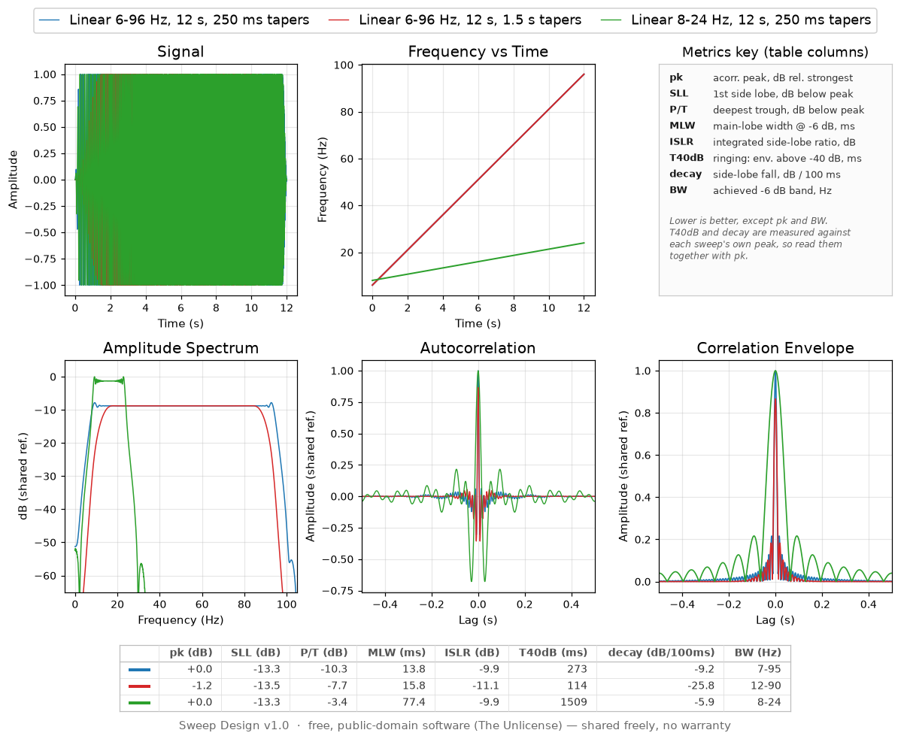

# Sweep Design

Design land Vibroseis sweeps and compare them side by side: overlay any
number of sweeps on one canvas and read off what each one does to the
correlation wavelet.



Three linear sweeps above — the same 6–96 Hz band with 250 ms and with
1.5 s tapers, and a narrow 8–24 Hz band. The table under the plots is the
point of the program: long tapers cost 2.6 dB of trough depth (`P/T`) and
2 ms of resolution (`MLW`) but cut the ringing from 273 ms to 114 ms
(`T40dB`), and the narrow band rings for 1.5 seconds.

Two files:

- `sweep_engine.py` — signal generation & analysis (no GUI, importable/testable on its own)
- `sweep_design.py` — tkinter GUI that wires the engine to a 5-panel overlay plot

## Run

```
python3 sweep_design.py
```

Requires `numpy`, `scipy`, `matplotlib` (with a display — Tk backend). No other dependencies.

A prebuilt Windows executable is on the
[releases page](https://github.com/rhodiak/vibroseis-sweep-design/releases)
— unpack the folder and run `SweepDesign.exe`, no Python needed. Take the
newest; see [Version history](#version-history) for what was wrong with
the older ones. To check a build is sound, `SweepDesign.exe --selftest`
(or `python3 sweep_design.py --selftest`) writes a file in every export
format and verifies the engine against known values.

## Workflow

1. On the **Sweep** tab: type, frequency range, length, start phase,
   start/end taper length + taper shape (Cosine/Blackman), **drive level
   (%)** (e.g. 70 for a 70% drive test), and **sample interval (ms)**
   (e.g. 2 ms -> 500 Hz sample rate). A live label shows the resulting
   sample rate, Nyquist frequency, and a conservative 0.8x-Nyquist "safe"
   ceiling — going over it doesn't block you, just flags a status note
   when you add the sweep. The **Label** field auto-fills with a full
   description of these settings (e.g.
   `Linear, 6-96 Hz, 12 s, tapers 250/250 ms cosine, 100% DL, 1 ms`) —
   tapers are always spelled out in milliseconds for both ends, a
   non-zero start phase is appended when set, and the type-specific
   extra (boost, t-power exponent, random seed/smoothing, pulse cycles)
   is appended for the sweep types that use one. The label stays
   live-updated as you edit fields, right up until you type something
   custom over it.
2. Type-specific extras appear automatically:
   - **dB/Octave** / **dB/Hz**: `Boost (dB, low->high)` — positive values bias
     sweep dwell time (and therefore energy) toward the high end of the band,
     negative toward the low end, 0 = standard log/linear sweep.
   - **T-power**: exponent `p` for an amplitude envelope `(t/T)^p` applied
     across the whole sweep (independent of the edge tapers).
   - **Random**: seed + smoothing window (s) for a band-limited random walk
     of instantaneous frequency.
   - **Pulse**: cycles-under-envelope, for a short broadband Gaussian-windowed
     wavelet centered in the band (included for comparison, not a true sweep).
3. Click **Add sweep to plot** — it overlays in a new color on all 5 panels:
   Signal, Frequency vs Time, Amplitude Spectrum, Autocorrelation, and
   Correlation Envelope (Hilbert envelope of the autocorrelation).
4. Add more sweeps to compare side by side (colors cycle automatically).
   **Remove last sweep** / **Clear all sweeps** as needed.
5. Use the **Axis ranges / zoom** tab to type explicit x/y min/max for any
   of the 5 panels (blank = auto-scale). Click **Apply zoom** to redraw
   with those bounds, or **Reset all to auto** to clear them. This only
   changes the data range shown inside the zoomed panel(s) -- every
   panel's position and size on the canvas is fixed and never shifts,
   regardless of what you zoom.
6. Pick **SVG** or **PNG** and click **Export figure...** to save the current
   overlay to disk.
7. **Stacking (theoretical)**: set **Stack count (n)**, **Sweep separation
   (m)**, and **Apparent velocity (m/s)**, then check **Also add stacked/
   array version** before clicking **Add sweep to plot**. This adds a
   second overlay trace alongside the single sweep: the coherent, noiseless
   composite of n identical sources, cross-correlated against the original
   single-unit reference (not against itself) -- see "Stacking" below.

## The metrics table (below the plots)

The legend names each sweep's parameters -- what you asked for. What came
out of it, the measured properties of that sweep's correlation wavelet, is
tabulated across the bottom of the figure, one row per sweep, so candidates
can be ranked by number and not only by eye:

```
      | pk (dB) | SLL (dB) | P/T (dB) | MLW (ms) | ... | BW (Hz)
 ———  |   +0.0  |   -13.3  |   -10.3  |    13.8  |     |   7-95
 ———  |   -3.7  |   -13.8  |    -8.1  |    14.9  |     |  11-94
```

Each row is keyed to its trace by a short line in the sweep's own colour --
the same cue the legend handle gives, and the only identifier the row needs:
the sweep's parameters are already spelled out in the legend directly above,
and printing them twice on one figure buys nothing but width. The numbers
used to trail each legend entry in brackets; in columns they line up, so
reading `SLL` down three sweeps is one glance instead of three sentences. A
metric that cannot be measured for a given wavelet (a Gaussian pulse has no
side lobes) shows an en dash rather than a blank.

| Metric | Meaning | Better |
|---|---|---|
| `pk`   | Autocorrelation peak, dB relative to the strongest sweep currently on the plot. An **amplitude** ratio, so it matches the trace heights in the autocorrelation panel — see the note below. Grows with length, drive level and stack count; *not* with the sample rate. | higher |
| `SLL`  | First side-lobe level, dB below the main peak. Correlation ringing that can be mistaken for, or mask, a nearby reflection. | lower |
| `P/T`  | Peak-to-trough: the deepest negative excursion of the wavelet, dB below its peak. The strength of the flanking side lobes an interpreter sees around every reflector. | lower |
| `MLW`  | Main-lobe width, full width of the correlation envelope at half amplitude (-6 dB), in ms — the wavelet's temporal resolution. | lower |
| `ISLR` | Integrated side-lobe ratio: all energy outside the main lobe over the energy inside it, in dB. Catches long low tails that `SLL` alone misses. | lower |
| `T40dB` | Ringing length: how far from the peak, in ms, the envelope is still above -40 dB. How long correlation noise keeps interfering with later events. | lower |
| `decay` | Slope of the side-lobe crests against lag, dB per 100 ms. How *fast* the ringing dies away, as distinct from how far it reaches. | more negative |
| `BW`   | Achieved -6 dB band edges of the amplitude spectrum. Compare against the requested `f1-f2`: tapers, nonlinear dwell shaping and array response all move them. | — |

### Reading `pk`

`pk` is `20*log10` of the correlation peak against the shared reference —
an amplitude ratio — even though the underlying quantity, `∫s²dt`, is an
energy. That is deliberate. The column exists to explain the
autocorrelation panel drawn directly above it, where every trace is
divided by that same reference and read as an amplitude. A sweep with half
the energy genuinely sits at half height there, and half height is -6 dB.
Using `10*log10` would make `pk` a textbook energy dB and stop it agreeing
with the picture it annotates.

So doubling the sweep length moves `pk` by about **+6 dB**:

| 6–96 Hz, 500/300 ms tapers, 70 % | `∫s²dt` | `pk` | as energy |
|---|---|---|---|
| 32 s | 7.7181 | +0.0 dB | +0.00 dB |
| 16 s | 3.7981 | -6.2 dB | -3.08 dB |
| 8 s | 1.8381 | -12.5 dB | -6.23 dB |

Each halving costs about 6 dB of `pk` and about 3 dB of energy. (The
energy ratio is 0.492 per step rather than 0.500 because the tapers cost a
fixed amount of time, so the shorter sweep loses proportionally more — the
same effect narrows `BW` from 7-95 to 9-94 Hz and takes `P/T` from -10.5
to -9.3 dB across those three.)

**That +6 dB is correlated signal amplitude, not signal-to-noise.** Random
noise correlates up as `sqrt(T)`, so doubling the sweep buys roughly **3 dB
of S/N**, the familiar Vibroseis rule. Read `pk` as "how tall this wavelet
stands on the plot", and halve the dB before treating it as a noise
argument.

`SLL` and `P/T` are both "how big are the side lobes", and they rarely
agree — they look in different places. `SLL` measures the **envelope**,
between lobes, and comes out near -13.3 dB for practically any bandpass
sweep, because that number is the sinc first side lobe of a boxcar
spectrum rather than a property of your sweep. `P/T` measures the
**signed** wavelet, and the deepest trough of a bandpass wavelet sits at
the first carrier half cycle — *inside* the envelope's main lobe, where
`SLL` never looks. So `P/T` is the one that responds to bandwidth:

| sweep | octaves | `P/T` | `SLL` | `MLW` |
|---|---|---|---|---|
| 6–96 Hz, 0.25 s cosine taper | 4.00 | **-10.3 dB** | -13.3 | 13.8 ms |
| 6–96 Hz, 1.5 s cosine taper | 4.00 | **-7.7** | -13.5 | 15.8 |
| 6–48 Hz | 3.00 | **-7.9** | -13.3 | 29.5 |
| 8–24 Hz | 1.58 | **-3.4** | -13.3 | 77.4 |
| 12–24 Hz | 1.00 | **-1.5** | -13.3 | 103.3 |
| 20–24 Hz | 0.26 | **-0.1** | -13.5 | 310.6 |

`SLL` moves 0.25 dB across that whole set; `P/T` moves 10 dB. At 20–24 Hz
the correlation is a ringing cosine whose troughs are 99 % as deep as its
peak, and only `P/T` says so. It also prices a long taper honestly: 0.25 s
→ 1.5 s costs 2.6 dB of `P/T` (the taper narrows the effective band) while
`SLL` shrugs. For scale, a Ricker wavelet sits at -7.0 dB — its textbook
0.4464 side lobe.

`T40dB` / `decay` are the ones to read when you care how long the wavelet
rings, which `SLL` (one lobe) and `ISLR` (an energy ratio) both miss —
"tall but brief" and "low but endless" can score the same on those two.
Note that both are measured against each sweep's **own** peak, so pair
them with `pk` when judging what a shared-reference plot shows: a sweep
with 10 dB more peak carries its whole side-lobe train 10 dB higher too.
Longer sweeps ring for longer in absolute time (12 s: `T40dB 229 ms,
decay -11.1 dB/100ms`; the same sweep at 4 s: `T40dB 124 ms,
decay -22.7 dB/100ms`) — their advantage is in `pk`, not in ringing.
Narrow bands are the worst offenders (20-40 Hz: `T40dB 1230 ms`).

`SLL` / `MLW` are the classic tradeoff: lengthening the tapers buys
side-lobe suppression and pays for it in resolution and bandwidth (a 3 s
taper on the sweep above gives `SLL -14.8 dB, ISLR -13.5 dB` but
`MLW 19.1 ms, BW 17-85 Hz`). `pk` is relative to the current overlay set,
so the whole column re-scales as sweeps are added or removed.

## Session persistence

Sweep parameters (everything on the Sweep tab, including stacking fields)
and axis-range/zoom settings are saved to `sweep_design_state.json` (next to
the script, so the folder stays self-contained) when you click **Exit**,
and restored automatically the next time you open the app -- so you pick
up right where you left off. **Save settings** / **Load settings** in the
footer let you save or revert manually at any point without exiting. Note
this remembers your *form* (last-used parameters and zoom), not the
sweeps already plotted on screen -- export those (SVG/PNG) if you want to
keep them.

## Layout

Six equal panels on a 2x3 grid. Row 1: **Signal**, **Frequency vs Time**,
**Metrics key**. Row 2: **Amplitude Spectrum**, **Autocorrelation**,
**Correlation Envelope**. Panel positions and sizes are fixed via
explicit figure margins (not auto-recomputed layout), so the canvas stays
tight and stable -- applying a zoom to one panel never shifts any other
panel's position or the overall canvas size.

The **Metrics key** panel (top right) is a static legend for the table's
column headings — one line per metric plus a note on how to read
them. It is drawn on the figure, not in a Tk widget, so it is part of
every exported SVG/PNG: an image that leaves the app carries its own
explanation, since there is no About dialog to consult outside it. This
is why **Signal** is one cell wide rather than the two-thirds of a row
it used to occupy.

The key sizes itself to fill its panel: on every resize it takes the
largest point size (up to 12 pt) at which both the widest row and the
whole stacked block still fit, and spaces the rows to match. The two
closing sentences are word-wrapped to the panel's current width —
measured in rendered pixels, not in characters — so they read as prose
at any window size instead of keeping fixed line breaks, and each starts
on its own line. On a window small enough that even the minimum size
won't fit (a tall legend over a short top row), the note drops out and
the abbreviations keep their space.

One shared legend spans the top of the figure instead of a repeated
legend on each of the 5 panels -- every sweep is one color across all
panels, so a single legend covers the whole set. Each entry is a single
line, the sweep's parameters; its column count and the top margin both
adapt automatically to how many sweeps are plotted (more sweeps wrap onto
more legend rows, and the plots shrink slightly to make room); clearing
all sweeps removes it and restores full plot height.

The **metrics table** occupies the strip between the x-axis labels and
the footer, and is likewise a figure artist, so it exports with the
image. It grows downward only -- one row per sweep, never a second block
of columns -- so adding sweeps never widens the canvas; the default
window is correspondingly taller than it used to be, so the strip comes
out of added height rather than out of the panels. Each column is sized
to the wider of its heading and its values, and the whole block is
centred on the canvas: with the sweep names left to the legend there is
no reason to stretch the numbers across the full width, and a centred
block reads as one object. A light grey grid separates the cells, with
the outer frame and the line under the headings a shade darker. On a
canvas too narrow to hold the block the whole table steps down a point
size at a time, to a floor of 6 pt.

Panel titles are set larger than matplotlib's default for readability.
All text (titles, axis labels, tick labels, the legend) scales together
with the window: resizing the app window rescales the whole figure and
every font size by the same proportional factor, so a small window and
a maximized one both look correctly proportioned -- nothing overlaps at
a small size, and nothing looks tiny at a large one.

### HiDPI / display scaling

All of the above is measured in pixels at 100 dpi, which is the right way
to reserve room for constant-size text and holds as long as one pixel means
one thing. On a display scaled above 100 % it stops holding.

matplotlib's Tk backend already raises the figure dpi to match the display
scale, so the program does not do that itself — it reads the scale back out
of the figure (`fpx()` is `n * fig.dpi / BASE_DPI`) and refreshes the pixel
budgets from it on every layout pass. Text and the room reserved for it
therefore grow together, and the panel fractions come out identical at
100 %, 125 %, 150 % and 200 %.

Doing it the other way round — detecting the scale independently and
multiplying the dpi — is what broke v1.0.2: the factor was applied twice,
once by the program and once by the backend, so a 150 % display rendered at
225 dpi and axis labels overlapped the neighbouring panels. Checked on
Windows 10 at 150 % on a 2560x1440 display, which is the only way this is
really testable: on X11 the backend's ratio is `winfo_fpixels('1i')/96`,
normally exactly 1.0, so the two scalings never meet there.

The factor is detected automatically on Windows only (where the process
also declares itself DPI-aware, without which the whole window would be
bitmap-stretched and blurry). Elsewhere it stays at 1.0 unless you ask:

```bash
SWEEP_DESIGN_SCALE=1.5 python sweep_design.py
```

To see what a given machine actually resolved to, open **About** — the last
block reports the display size, the detected scale, Tk's scaling, and the
dpi the figure ended up at. `--selftest` prints the same numbers without
opening a window. The line to read is the figure dpi: at 150 % it should
say `150 dpi = 1.5x nominal`. Anything else — `225 dpi = 2.25x nominal`,
say — means the scale is being applied more than once, which is what went
wrong in v1.0.2 and is not reliably visible by eye.

One side effect: exported PNGs come out at the scaled dpi, so the same
figure saved on a 150 % display has 1.5x the pixels for the same physical
size. SVG is vector and unaffected. See `BUILD.md` for the details.

## Amplitude comparisons across sweeps (important)

Spectrum / autocorrelation / envelope are normalized **once**, using a
single shared reference across every sweep currently on the plot — not
per-trace. A longer sweep or a higher drive level really does put more
energy into the ground, so it correctly shows a taller autocorrelation
peak and a higher spectrum level than a shorter or quieter one. Earlier
drafts of this tool normalized each trace to its own peak independently,
which silently erased that difference (e.g. a 32s and 12s sweep would
show identical correlation peak heights) — that's fixed now. Concretely,
the autocorrelation zero-lag peak scales with signal energy: roughly
proportional to duration, and proportional to (drive level)² since energy
goes as amplitude squared.

**The sample rate is not one of those things.** The spectrum and the
correlation both carry a `dt` factor, so they measure the continuous
quantities they stand for — spectral density in amplitude·s, energy
∫s²dt — rather than bare sums over samples. Re-read the same 12 s sweep
at 1 ms instead of 2 ms and `pk` moves by 0.01 dB, not 6 dB. Without
that factor, halving `dt` doubles the sample count and every sum with
it, which would look exactly like a 6 dB gain and would tempt you to
believe a finer sample rate had put more energy into the ground. It has
not: a finer `dt` buys you Nyquist headroom and a better-resolved
wavelet apex, nothing else. (Coarse sampling does cost a little real
accuracy — at 4 ms the 96 Hz end has only ~2.6 samples/cycle, and `MLW`
reads 13.58 ms against a converged 13.76 ms — but that is a measurement
error, and it is tenths of a dB, not decibels.)

## Stacking (theoretical)

Two distinct, physically different scenarios, both modeled as noiseless
and deterministic (no ground-coupling variability, no ambient noise, no
statics/NMO) -- this isolates what geometry alone changes:

- **Stationary (separation = 0)**: n identical sources/repeats, all at
  the same point. The composite signal is simply `n * single_sweep` --
  pure linear amplitude gain, **no change in shape**. Cross-correlated
  against the original single-unit reference, the peak scales by exactly
  n, and the sidelobe-to-mainlobe ratio is IDENTICAL to a single sweep --
  verified numerically (0.056649 both with and without a x4 stationary
  stack). In other words: a purely theoretical stationary stack does not
  improve sweep compressibility/resolution at all, only amplitude. The
  real-world reason to stack (SNR improvement against random ambient
  noise and ground-coupling variability, roughly sqrt(n) in amplitude) is
  NOT captured by this deterministic model.

- **Spaced array (separation > 0)**: n sources spaced `d` meters apart,
  combined as seen by a wavefield component arriving at a chosen
  **apparent velocity** (e.g. a typical ground-roll speed). This applies
  a genuine frequency-dependent array response -- a scalloped/notched
  gain pattern in the spectrum -- that DOES reshape the correlation
  function differently from stationary stacking. It can suppress a
  target velocity band (classic use: attenuating ground roll relative to
  higher-apparent-velocity reflections) but can just as easily hurt: in
  one test case (n=3, d=10m, v=350 m/s) the array's cross-correlation
  peak came out to 0.87x the SINGLE sweep -- lower than doing nothing --
  due to destructive interference at that particular spacing/velocity/
  frequency-band combination. Geometry has to be chosen deliberately
  against your actual sweep band and the apparent velocities present at
  your site; it isn't automatically an improvement.

Important: the stacked/array signal is cross-correlated against the
ORIGINAL, unscaled single-unit sweep (not against itself). Correlating a
composite against itself would show an n² peak, which doesn't correspond
to what real processing does (correlate each record against a fixed
reference/pilot sweep, then sum the correlated results) and would
overstate the gain.

## Notes on the physics (see docstring in `sweep_engine.py` for detail)

- Linear: constant Hz/s sweep rate.
- dB/Octave & dB/Hz: nonlinear sweeps solved numerically so that the local
  sweep rate (and therefore local energy) follows a boost profile that's
  linear in log2(f) (per octave) or linear in f (per Hz), respectively.
- T-power: linear frequency law with a `(t/T)^p` amplitude envelope.
- Random: smoothed random-walk instantaneous frequency, clipped to band.
- Pulse: Gaussian-enveloped tone burst at the band center frequency — a
  simplified stand-in for an impulsive source, not a real sweep.

These are reasonable working definitions, not vendor-specific formulas —
worth checking against your acquisition system's actual sweep generator
docs (Sercel/INOVA/etc.) if you need to match a specific unit's output
before using this for real QC.

## Version history

Newest first. Every version is on the
[releases page](https://github.com/rhodiak/vibroseis-sweep-design/releases)
with a Windows build attached; **use the latest**. Older ones are kept
rather than deleted, so a link or a citation to a specific build does not
rot, and so the defects below stay on the record — but the known problems
are listed here precisely so nobody downloads an old one by accident.

| Version | Changes | Known problems |
|---|---|---|
| **1.0.4** | About box and `--selftest` now report the detected display scale and the resulting figure dpi. | None reported. |
| 1.0.3 | Fixes the display-scaling overlap. | None reported. Confirmed on Windows 10 at 150 % scaling, 2560x1440. |
| 1.0.2 | Window is clamped to the display. The Windows build no longer bundles a redundant CI artifact. | **On a display scaled above 100 %, axis labels overlap the neighbouring panels or are cut off** — bad at 150 %, marginal at 125 %. The display scale was applied twice, once by this program and once by matplotlib's Tk backend. Unaffected at 100 %. Fixed in 1.0.3. |
| 1.0.1 | Fixes SVG export in the Windows build. Adds `--selftest`, which CI now runs against the frozen executable. | The default window is sized without checking the display, so on a screen scaled above 100 % — or any 1080p screen — it can open larger than the desktop, with the metrics table below the bottom edge. Fixed in 1.0.2. |
| 1.0 | First public release. | **The Windows build cannot export SVG**, the default format ("No module named `matplotlib.backends.backend_svg`"). PNG works. Also has the 1.0.1 window problem. Fixed in 1.0.1. |

Both defects above were in the *packaged Windows build* only; running from
source was unaffected in each case. That is the recurring hazard with a
frozen application, and why `--selftest` exists: it exercises the parts
that only fail once packaged, and the release cannot publish unless it
passes.

Versions are `MAJOR.MINOR.PATCH`. `APP_VERSION` in `sweep_design.py` is the
single source of truth — the release workflow refuses a tag that disagrees
with it, so the About box and the download name can never drift apart.

## Licence — none, deliberately

This is free and unencumbered software released into the public domain
under [The Unlicense](https://unlicense.org) (full text in `LICENSE`).
Copy it, change it, publish it, sell it, ship it inside something else —
no permission needed, no attribution required, no warranty given.

The explicit dedication matters: code with *nothing* said about its terms
is copyrighted by default and legally unusable by anyone else, so "no
licence" only actually means "free for all" when it's written down.

Built and shared freely by a vibroseis enthusiast, for anyone who finds
it useful. Every exported plot carries the same statement in its footer.
