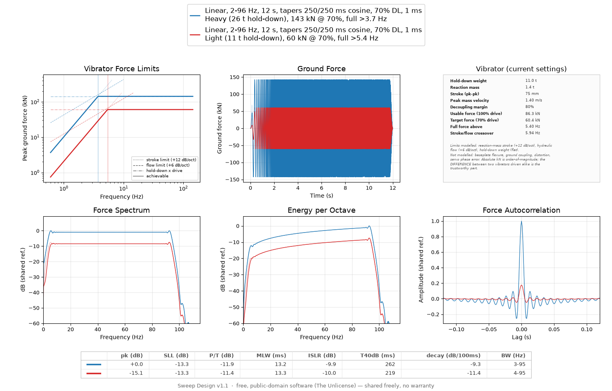

# Sweep Design

Design land Vibroseis sweeps and compare them side by side: overlay any
number of sweeps on one canvas and read off what each one does to the
correlation wavelet.


Three linear sweeps above — the same 6–96 Hz band with 250 ms and with
1.5 s tapers, and a narrow 8–24 Hz band. The table under the plots is the
point of the program: long tapers cost 2.6 dB of trough depth (`P/T`) and
2 ms of resolution (`MLW`) but cut the ringing from 273 ms to 114 ms
(`T40dB`), and the narrow band rings for 1.5 seconds.

Four files:

- `sweep_engine.py` — signal generation & analysis (no GUI, importable/testable on its own)
- `sweep_design.py` — tkinter GUI that wires the engine to a two-view, six-panel overlay plot
- `sweep_export.py` — ASCII, SEG-Y and Petrel wavelet writing (no GUI either; byte layout, kept where it can be tested)
- `sweep_manual.py` — turns this README into the HTML manual the Help button opens

Two views share the canvas. **Sweep design** is the sweep as you specify
it — dimensionless, the reference a correlator would use. **Field model**
is the same sweeps in kN, as a particular vibrator can actually radiate
them, under its stroke, flow and hold-down limits. Switch between them
with the radio above the tabs; both draw the same sweep set, and nothing
is regenerated.

Either view can be exported as a figure (SVG/PNG) or as the samples
themselves — sweep and/or correlation wavelet, as an ASCII table, a SEG-Y
rev 1 file and/or Petrel ASCII wavelets. See
[Exporting traces](#exporting-traces).

## Run

```
python3 sweep_design.py
```

Requires `numpy`, `scipy`, `matplotlib` (with a display — Tk backend). No other dependencies.

A prebuilt Windows executable is on the
[releases page](https://github.com/rhodiak/vibroseis-sweep-design/releases)
— unpack the folder and run `SweepDesign.exe`, no Python needed. Take the
newest; see [Version history](#version-history) for what was wrong with
the older ones. To check a build is sound, `SweepDesign.exe --selftest`
(or `python3 sweep_design.py --selftest`) writes a file in every export
format and verifies the engine against known values.

## Help and About

**Help**, in the footer, opens this document as a formatted manual in your
web browser — contents sidebar, working cross-references, and Ctrl+F over
the whole thing. It is generated on the spot from the `README.md` bundled
with the copy you are running, so it always describes *that* build rather
than whatever is newest on GitHub, and it cannot drift out of step with
the program the way a separately maintained manual would.

For a PDF or a printed copy, use the browser's **Print → Save as PDF**.
The page carries a print stylesheet: the navigation is dropped, colours go
to black on white, and headings, tables and code blocks are kept from
being split across a page break.

**About** is deliberately short — what the program is, its version, where
it keeps its settings and its vibrator library, and the licence. Everything
technical lives in the manual, which is a better place to read 30 pages of
reference than a message box.

## Workflow

1. On the **Sweep** tab: type, frequency range, length, start phase,
   start/end taper length + taper shape (Cosine/Blackman), **drive level
   (%)** (e.g. 70 for a 70% drive test), and **sample interval (ms)**
   (e.g. 2 ms -> 500 Hz sample rate). A live label shows the resulting
   sample rate, Nyquist frequency, and a conservative 0.8x-Nyquist "safe"
   ceiling — going over it doesn't block you, just flags a status note
   when you add the sweep. The **Label** field auto-fills with a full
   description of these settings (e.g.
   `Linear, 6-96 Hz, 12 s, tapers 250/250 ms cosine, 100% DL, 1 ms`) —
   tapers are always spelled out in milliseconds for both ends, a
   non-zero start phase is appended when set, and the type-specific
   extra (boost, t-power exponent, random seed/smoothing, pulse cycles)
   is appended for the sweep types that use one. The label stays
   live-updated as you edit fields, right up until you type something
   custom over it.
2. Type-specific extras appear automatically:
   - **dB/Octave** / **dB/Hz**: `Boost (dB, low->high)` — positive values bias
     sweep dwell time (and therefore energy) toward the high end of the band,
     negative toward the low end, 0 = standard log/linear sweep.
   - **T-power**: exponent `p` for an amplitude envelope `(t/T)^p` applied
     across the whole sweep (independent of the edge tapers).
   - **Random**: seed + smoothing window (s) for a band-limited random walk
     of instantaneous frequency.
   - **Pulse**: cycles-under-envelope, for a short broadband Gaussian-windowed
     wavelet centered in the band (included for comparison, not a true sweep).
3. On the **Vibrator** tab: pick a size-class preset or type the machine's
   own figures — hold-down weight, reaction mass, peak-to-peak stroke, peak
   reaction-mass velocity, decoupling margin — in SI or field units. The
   derived numbers (usable force, the frequency above which full force is
   reachable, the stroke/flow crossover) update as you type. **Save
   vibrator** files a machine you have entered under its own name so it
   joins the preset list for good — worth doing once per unit in your
   fleet rather than re-typing a spec sheet each session. See
   "Vibrator force model" below.
4. Click **Add sweep to plot** — it overlays in a new color on all 5 data
   panels of both views: Signal, Frequency vs Time, Amplitude Spectrum,
   Autocorrelation, and Correlation Envelope (Hilbert envelope of the
   autocorrelation) in the sweep view; Vibrator Force Limits, Ground
   Force, Force Spectrum, Energy per Octave and Force Autocorrelation in
   the field view. The vibrator set at that moment is recorded **with**
   the sweep, so a heavy unit and a light one can be overlaid.
5. Add more sweeps to compare side by side (colors cycle automatically).
   **Remove last sweep** / **Clear all sweeps** as needed.
6. Use the **Axis ranges / zoom** tab to type explicit x/y min/max for any
   panel of either view (blank = auto-scale). Click **Apply zoom** to redraw
   with those bounds, or **Reset all to auto** to clear them. This only
   changes the data range shown inside the zoomed panel(s) -- every
   panel's position and size on the canvas is fixed and never shifts,
   regardless of what you zoom.
7. Pick an **image format** (SVG or PNG) and click **Figure...** under
   Export to save the current overlay as a picture. The two views export
   separately — switch and export again for the other one. Click
   **Traces (data)...** instead to export the *samples* — the sweep, its
   autocorrelation wavelet, or both, as an ASCII table, a SEG-Y file
   and/or Petrel ASCII wavelets. See "Exporting traces" below.
8. **Stacking (theoretical)**: set **Stack count (n)**, **Sweep separation
   (m)**, and **Apparent velocity (m/s)**, then check **Also add stacked/
   array version** before clicking **Add sweep to plot**. This adds a
   second overlay trace alongside the single sweep: the coherent, noiseless
   composite of n identical sources, cross-correlated against the original
   single-unit reference (not against itself) -- see "Stacking" below.

## The metrics table (below the plots)

The legend names each sweep's parameters -- what you asked for. What came
out of it, the measured properties of that sweep's correlation wavelet, is
tabulated across the bottom of the figure, one row per sweep, so candidates
can be ranked by number and not only by eye:

```
      | pk (dB) | SLL (dB) | P/T (dB) | MLW (ms) | ... | BW (Hz)
 ———  |   +0.0  |   -13.3  |   -10.3  |    13.8  |     |   7-95
 ———  |   -3.7  |   -13.8  |    -8.1  |    14.9  |     |  11-94
```

Each row is keyed to its trace by a short line in the sweep's own colour --
the same cue the legend handle gives, and the only identifier the row needs:
the sweep's parameters are already spelled out in the legend directly above,
and printing them twice on one figure buys nothing but width. The numbers
used to trail each legend entry in brackets; in columns they line up, so
reading `SLL` down three sweeps is one glance instead of three sentences. A
metric that cannot be measured for a given wavelet (a Gaussian pulse has no
side lobes) shows an en dash rather than a blank.

| Metric | Meaning | Better |
|---|---|---|
| `pk`   | Autocorrelation peak, dB relative to the strongest sweep currently on the plot. An **amplitude** ratio, so it matches the trace heights in the autocorrelation panel — see the note below. Grows with length, drive level and stack count; *not* with the sample rate. | higher |
| `SLL`  | First side-lobe level, dB below the main peak. Correlation ringing that can be mistaken for, or mask, a nearby reflection. | lower |
| `P/T`  | Peak-to-trough: the deepest negative excursion of the wavelet, dB below its peak. The strength of the flanking side lobes an interpreter sees around every reflector. | lower |
| `MLW`  | Main-lobe width, full width of the correlation envelope at half amplitude (-6 dB), in ms — the wavelet's temporal resolution. | lower |
| `ISLR` | Integrated side-lobe ratio: all energy outside the main lobe over the energy inside it, in dB. Catches long low tails that `SLL` alone misses. | lower |
| `T40dB` | Ringing length: how far from the peak, in ms, the envelope is still above -40 dB. How long correlation noise keeps interfering with later events. | lower |
| `decay` | Slope of the side-lobe crests against lag, dB per 100 ms. How *fast* the ringing dies away, as distinct from how far it reaches. | more negative |
| `BW`   | Achieved -6 dB band edges of the amplitude spectrum. Compare against the requested `f1-f2`: tapers, nonlinear dwell shaping and array response all move them. | — |

### Reading `pk`

`pk` is `20*log10` of the correlation peak against the shared reference —
an amplitude ratio — even though the underlying quantity, `∫s²dt`, is an
energy. That is deliberate. The column exists to explain the
autocorrelation panel drawn directly above it, where every trace is
divided by that same reference and read as an amplitude. A sweep with half
the energy genuinely sits at half height there, and half height is -6 dB.
Using `10*log10` would make `pk` a textbook energy dB and stop it agreeing
with the picture it annotates.

So doubling the sweep length moves `pk` by about **+6 dB**:

| 6–96 Hz, 500/300 ms tapers, 70 % | `∫s²dt` | `pk` | as energy |
|---|---|---|---|
| 32 s | 7.7181 | +0.0 dB | +0.00 dB |
| 16 s | 3.7981 | -6.2 dB | -3.08 dB |
| 8 s | 1.8381 | -12.5 dB | -6.23 dB |

Each halving costs about 6 dB of `pk` and about 3 dB of energy. (The
energy ratio is 0.492 per step rather than 0.500 because the tapers cost a
fixed amount of time, so the shorter sweep loses proportionally more — the
same effect narrows `BW` from 7-95 to 9-94 Hz and takes `P/T` from -10.5
to -9.3 dB across those three.)

**That +6 dB is correlated signal amplitude, not signal-to-noise.** Random
noise correlates up as `sqrt(T)`, so doubling the sweep buys roughly **3 dB
of S/N**, the familiar Vibroseis rule. Read `pk` as "how tall this wavelet
stands on the plot", and halve the dB before treating it as a noise
argument.

`SLL` and `P/T` are both "how big are the side lobes", and they rarely
agree — they look in different places. `SLL` measures the **envelope**,
between lobes, and comes out near -13.3 dB for practically any bandpass
sweep, because that number is the sinc first side lobe of a boxcar
spectrum rather than a property of your sweep. `P/T` measures the
**signed** wavelet, and the deepest trough of a bandpass wavelet sits at
the first carrier half cycle — *inside* the envelope's main lobe, where
`SLL` never looks. So `P/T` is the one that responds to bandwidth:

| sweep | octaves | `P/T` | `SLL` | `MLW` |
|---|---|---|---|---|
| 6–96 Hz, 0.25 s cosine taper | 4.00 | **-10.3 dB** | -13.3 | 13.8 ms |
| 6–96 Hz, 1.5 s cosine taper | 4.00 | **-7.7** | -13.5 | 15.8 |
| 6–48 Hz | 3.00 | **-7.9** | -13.3 | 29.5 |
| 8–24 Hz | 1.58 | **-3.4** | -13.3 | 77.4 |
| 12–24 Hz | 1.00 | **-1.5** | -13.3 | 103.3 |
| 20–24 Hz | 0.26 | **-0.1** | -13.5 | 310.6 |

`SLL` moves 0.25 dB across that whole set; `P/T` moves 10 dB. At 20–24 Hz
the correlation is a ringing cosine whose troughs are 99 % as deep as its
peak, and only `P/T` says so. It also prices a long taper honestly: 0.25 s
→ 1.5 s costs 2.6 dB of `P/T` (the taper narrows the effective band) while
`SLL` shrugs. For scale, a Ricker wavelet sits at -7.0 dB — its textbook
0.4464 side lobe.

`T40dB` / `decay` are the ones to read when you care how long the wavelet
rings, which `SLL` (one lobe) and `ISLR` (an energy ratio) both miss —
"tall but brief" and "low but endless" can score the same on those two.
Note that both are measured against each sweep's **own** peak, so pair
them with `pk` when judging what a shared-reference plot shows: a sweep
with 10 dB more peak carries its whole side-lobe train 10 dB higher too.
Longer sweeps ring for longer in absolute time (12 s: `T40dB 229 ms,
decay -11.1 dB/100ms`; the same sweep at 4 s: `T40dB 124 ms,
decay -22.7 dB/100ms`) — their advantage is in `pk`, not in ringing.
Narrow bands are the worst offenders (20-40 Hz: `T40dB 1230 ms`).

`SLL` / `MLW` are the classic tradeoff: lengthening the tapers buys
side-lobe suppression and pays for it in resolution and bandwidth (a 3 s
taper on the sweep above gives `SLL -14.8 dB, ISLR -13.5 dB` but
`MLW 19.1 ms, BW 17-85 Hz`). `pk` is relative to the current overlay set,
so the whole column re-scales as sweeps are added or removed.

## Session persistence

Sweep parameters (everything on the Sweep tab, including stacking fields)
and axis-range/zoom settings are saved to `sweep_design_state.json` (next to
the script, so the folder stays self-contained) when you click **Exit**,
and restored automatically the next time you open the app -- so you pick
up right where you left off. **Save settings** / **Load settings** in the
footer let you save or revert manually at any point without exiting. Note
this remembers your *form* (last-used parameters and zoom), not the
sweeps already plotted on screen -- export those (as a figure or as
[traces](#exporting-traces)) if you want to keep them.

Vibrators saved with **Save vibrator** are deliberately *not* part of
this. They live in their own file, are written the moment you save one
rather than at exit, and survive a settings reset — see
[Saving your own vibrators](#saving-your-own-vibrators).

## Exporting traces

**Export → Traces (data)...** writes the samples themselves rather than a
picture of them: the sweep to load into acquisition or QC software as a
pilot/reference trace, and the autocorrelation wavelet to see what a
reflection will actually look like once the record is correlated. One
trace per sweep on the plot, in the order they were added, so an overlay
comparison stays a comparison in the file.

The dialog has eight choices.

| Choice | What it does |
|---|---|
| **What to write** | The sweep, the autocorrelation wavelet, or both. Each goes to its own file. |
| **Take it from** | *Sweep design* — the sweep as specified, dimensionless. *Field model* — the ground force the recorded vibrator can actually radiate, in newtons, stroke/flow/hold-down limits included. Defaults to whichever view is on screen. |
| **Amplitude** | *As computed* leaves the numbers alone, so a longer or harder-driven sweep really is bigger. *Normalized* divides the whole set by one shared maximum: the loudest trace peaks at 1 and the rest keep their true size relative to it. Never per-trace — that would throw the comparison away. |
| **Wavelet length** | *Full, symmetric* centres the trace on the zero-lag peak. *Half, from zero lag* keeps only the positive side; the autocorrelation is an even function, so this discards nothing and halves the file. |
| **Samples per trace** | How many samples of wavelet. Blank means the whole autocorrelation (twice the sweep length, and nearly all of it zeros). A live line under the box translates the count into milliseconds of lag. An even count on a symmetric wavelet is rounded up by one so the peak gets a sample of its own. The **sweep** is always written at its own full length. |
| **File formats** | ASCII table, SEG-Y, Petrel ASCII wavelet, or any combination. |
| **SEG-Y sample format** | IBM 32-bit float (format code 1, the historical default, read by everything, good to ~7 digits) or IEEE 32-bit float (code 5, exact, standard since revision 1). |

You are asked for one **base name** and the program derives the rest, so
"`sweep_export`" with everything ticked produces `sweep_export_sweep.txt`,
`sweep_export_sweep.sgy`, `sweep_export_wavelet.txt` and
`sweep_export_wavelet.sgy`, plus a `.wlt` per sweep if the Petrel format
is ticked.

### What is in the files

**ASCII** is one whitespace-delimited table: a `#` comment block naming
every trace, its parameters and its vibrator, then a `time_ms` column
followed by one amplitude column per sweep. It loads with
`numpy.loadtxt(path)` with no arguments, and reads fine in `awk`, a
spreadsheet or an editor.

The time column is in **milliseconds**, matching everything else the
program quotes — sample interval, taper lengths, wavelet window, and the
SEG-Y delay field. A full symmetric wavelet therefore starts at a
negative time (`-500.000000` for a 1001-sample wavelet at 1 ms), and that
first value is the same number SEG-Y carries in its delay recording time.

**SEG-Y** is revision 1, big-endian, fixed trace length, one trace per
sweep. The sweep-description fields in each trace header are filled in
from that sweep's own parameters rather than left at zero:

| Bytes | Field | Value |
|---|---|---|
| 29–30 | trace identification | 6 (sweep) for a sweep, 1 (seismic data) for a wavelet |
| 109–110 | delay recording time | 0, or **negative** for a symmetric wavelet |
| 125–126 | correlated | 1 for a sweep, 2 for a wavelet |
| 127–130 | sweep frequency start / end | `f1`, `f2` in Hz |
| 131–132 | sweep length | ms |
| 133–134 | sweep type | 1 linear, 3 for the dB/octave and dB/Hz laws, 4 otherwise |
| 135–138 | taper length start / end | ms |
| 139–140 | taper type | 2 for Cosine, 3 for Blackman |

The negative delay is the part worth knowing about: a symmetric wavelet's
first sample precedes zero lag, and that offset is what puts the zero-lag
peak at time zero instead of half a wavelet in. Software that ignores the
delay field will show the peak in the middle of the trace instead.

**Petrel ASCII wavelet** (`.wlt`) is the keyword layout Petrel and its
relatives import a wavelet from:

```
WAVELET-NAME  Linear, 6-120 Hz, 20 s, tapers 500/1000 ms... [wavelet]
WAVELET-TFS   -500.00000000
SAMPLE-RATE   1.00000000
WAVELET-DESC  Sweep Design 1.1 -- exported traces
              ...the same description block the other two formats carry...
HISTORY       2026-08-20 14:07  Created by Sweep Design 1.1
EOH
            0.00       0.00428005
            1.00      -0.00512217
        ...
         1000.00       0.00428005
EOD
```

Two things about it differ from the ASCII table above, and both matter:

- **One wavelet per file.** The layout has a single name and a single
  amplitude column, so a plot with three sweeps produces three files —
  `sweep_export_wavelet_1.wlt`, `_2`, `_3`, numbered in the order the
  sweeps were added. A single sweep drops the number. Amplitude
  normalization is still shared across the whole set, so the files stay
  comparable with each other.
- **The time column is a 0-based offset**, not the wavelet's real time
  axis. It counts `0, dt, 2dt …` whatever the wavelet is; the true time
  of the first sample is carried once, in `WAVELET-TFS`. A full symmetric
  wavelet therefore has `WAVELET-TFS -500.0` and a column running 0 to
  1000, and software that ignored `WAVELET-TFS` would place the zero-lag
  peak half a wavelet late. `WAVELET-TFS` and `SAMPLE-RATE` are both in
  milliseconds, the same numbers the ASCII table and the SEG-Y delay
  field use.

`WAVELET-NAME` is the sweep's label with `[sweep]` or `[wavelet]`
appended, so the two files from one sweep do not collide once imported.
Names are trimmed to fit the layout's 80-column line; the untrimmed label
is always in `WAVELET-DESC`.

This format is offered because it is what some interpretation packages
want, not as a replacement for the ASCII table — the table exists so
several sweeps compare in one file, which this layout cannot express. It
is the one format that is **off by default**.

### Limits and edge cases

- **One sample interval per file.** SEG-Y allows only one, so sweeps on
  the plot at different sample intervals are refused with a message
  naming them — before you are asked where to put the file, not after.
  Export them separately.
- **Different lengths are zero-padded** to the longest, and the header
  says so. Silence after a short sweep ends is the honest continuation;
  resampling would not be.
- **Sample count is a 16-bit field.** Above 32767 samples per trace the
  file is still written correctly, but some readers treat that field as
  signed and will misread it, so you get a warning first. Above 65535 the
  export is refused; shorten the sweep, widen the sample interval, or ask
  for fewer wavelet samples.
- **Units.** A design sweep is dimensionless (±1 at 100% drive level);
  the field-model force trace is in newtons and is tagged as such in the
  SEG-Y trace value measurement unit field. A correlation wavelet is in
  amplitude² × seconds (or N² × seconds), which the standard has no code
  for, so that field is left at zero and the units are stated in the
  header text instead.

## Layout

Six equal panels on a 2x3 grid. Row 1: **Signal**, **Frequency vs Time**,
**Metrics key**. Row 2: **Amplitude Spectrum**, **Autocorrelation**,
**Correlation Envelope**. Panel positions and sizes are fixed via
explicit figure margins (not auto-recomputed layout), so the canvas stays
tight and stable -- applying a zoom to one panel never shifts any other
panel's position or the overall canvas size.

The **Metrics key** panel (top right) is a static legend for the table's
column headings — one line per metric plus a note on how to read
them. It is drawn on the figure, not in a Tk widget, so it is part of
every exported SVG/PNG: an image that leaves the app carries its own
explanation, since there is no About dialog to consult outside it. This
is why **Signal** is one cell wide rather than the two-thirds of a row
it used to occupy.

The key sizes itself to fill its panel: on every resize it takes the
largest point size (up to 12 pt) at which both the widest row and the
whole stacked block still fit, and spaces the rows to match. The two
closing sentences are word-wrapped to the panel's current width —
measured in rendered pixels, not in characters — so they read as prose
at any window size instead of keeping fixed line breaks, and each starts
on its own line. On a window small enough that even the minimum size
won't fit (a tall legend over a short top row), the note drops out and
the abbreviations keep their space.

One shared legend spans the top of the figure instead of a repeated
legend on each of the 5 panels -- every sweep is one color across all
panels, so a single legend covers the whole set. Each entry is a single
line, the sweep's parameters; its column count and the top margin both
adapt automatically to how many sweeps are plotted (more sweeps wrap onto
more legend rows, and the plots shrink slightly to make room); clearing
all sweeps removes it and restores full plot height.

The **metrics table** occupies the strip between the x-axis labels and
the footer, and is likewise a figure artist, so it exports with the
image. It grows downward only -- one row per sweep, never a second block
of columns -- so adding sweeps never widens the canvas; the default
window is correspondingly taller than it used to be, so the strip comes
out of added height rather than out of the panels. Each column is sized
to the wider of its heading and its values, and the whole block is
centred on the canvas: with the sweep names left to the legend there is
no reason to stretch the numbers across the full width, and a centred
block reads as one object. A light grey grid separates the cells, with
the outer frame and the line under the headings a shade darker. On a
canvas too narrow to hold the block the whole table steps down a point
size at a time, to a floor of 6 pt.

Panel titles are set larger than matplotlib's default for readability.
All text (titles, axis labels, tick labels, the legend) scales together
with the window: resizing the app window rescales the whole figure and
every font size by the same proportional factor, so a small window and
a maximized one both look correctly proportioned -- nothing overlaps at
a small size, and nothing looks tiny at a large one.

### HiDPI / display scaling

All of the above is measured in pixels at 100 dpi, which is the right way
to reserve room for constant-size text and holds as long as one pixel means
one thing. On a display scaled above 100 % it stops holding.

matplotlib's Tk backend already raises the figure dpi to match the display
scale, so the program does not do that itself — it reads the scale back out
of the figure (`fpx()` is `n * fig.dpi / BASE_DPI`) and refreshes the pixel
budgets from it on every layout pass. Text and the room reserved for it
therefore grow together, and the panel fractions come out identical at
100 %, 125 %, 150 % and 200 %.

Doing it the other way round — detecting the scale independently and
multiplying the dpi — is what broke v1.0.2: the factor was applied twice,
once by the program and once by the backend, so a 150 % display rendered at
225 dpi and axis labels overlapped the neighbouring panels. Checked on
Windows 10 at 150 % on a 2560x1440 display, which is the only way this is
really testable: on X11 the backend's ratio is `winfo_fpixels('1i')/96`,
normally exactly 1.0, so the two scalings never meet there.

The factor is detected automatically on Windows only (where the process
also declares itself DPI-aware, without which the whole window would be
bitmap-stretched and blurry). Elsewhere it stays at 1.0 unless you ask:

```bash
SWEEP_DESIGN_SCALE=1.5 python sweep_design.py
```

To see what a given machine actually resolved to, open **About** — the last
block reports the display size, the detected scale, Tk's scaling, and the
dpi the figure ended up at. `--selftest` prints the same numbers without
opening a window. The line to read is the figure dpi: at 150 % it should
say `150 dpi = 1.5x nominal`. Anything else — `225 dpi = 2.25x nominal`,
say — means the scale is being applied more than once, which is what went
wrong in v1.0.2 and is not reliably visible by eye.

One side effect: exported PNGs come out at the scaled dpi, so the same
figure saved on a 150 % display has 1.5x the pixels for the same physical
size. SVG is vector and unaffected. See `BUILD.md` for the details.

## Amplitude comparisons across sweeps (important)

Spectrum / autocorrelation / envelope are normalized **once**, using a
single shared reference across every sweep currently on the plot — not
per-trace. A longer sweep or a higher drive level really does put more
energy into the ground, so it correctly shows a taller autocorrelation
peak and a higher spectrum level than a shorter or quieter one. Earlier
drafts of this tool normalized each trace to its own peak independently,
which silently erased that difference (e.g. a 32s and 12s sweep would
show identical correlation peak heights) — that's fixed now. Concretely,
the autocorrelation zero-lag peak scales with signal energy: roughly
proportional to duration, and proportional to (drive level)² since energy
goes as amplitude squared.

**The sample rate is not one of those things.** The spectrum and the
correlation both carry a `dt` factor, so they measure the continuous
quantities they stand for — spectral density in amplitude·s, energy
∫s²dt — rather than bare sums over samples. Re-read the same 12 s sweep
at 1 ms instead of 2 ms and `pk` moves by 0.01 dB, not 6 dB. Without
that factor, halving `dt` doubles the sample count and every sum with
it, which would look exactly like a 6 dB gain and would tempt you to
believe a finer sample rate had put more energy into the ground. It has
not: a finer `dt` buys you Nyquist headroom and a better-resolved
wavelet apex, nothing else. (Coarse sampling does cost a little real
accuracy — at 4 ms the 96 Hz end has only ~2.6 samples/cycle, and `MLW`
reads 13.58 ms against a converged 13.76 ms — but that is a measurement
error, and it is tenths of a dB, not decibels.)

## Stacking (theoretical)

Two distinct, physically different scenarios, both modeled as noiseless
and deterministic (no ground-coupling variability, no ambient noise, no
statics/NMO) -- this isolates what geometry alone changes:

- **Stationary (separation = 0)**: n identical sources/repeats, all at
  the same point. The composite signal is simply `n * single_sweep` --
  pure linear amplitude gain, **no change in shape**. Cross-correlated
  against the original single-unit reference, the peak scales by exactly
  n, and the sidelobe-to-mainlobe ratio is IDENTICAL to a single sweep --
  verified numerically (0.056649 both with and without a x4 stationary
  stack). In other words: a purely theoretical stationary stack does not
  improve sweep compressibility/resolution at all, only amplitude. The
  real-world reason to stack (SNR improvement against random ambient
  noise and ground-coupling variability, roughly sqrt(n) in amplitude) is
  NOT captured by this deterministic model.

- **Spaced array (separation > 0)**: n sources spaced `d` meters apart,
  combined as seen by a wavefield component arriving at a chosen
  **apparent velocity** (e.g. a typical ground-roll speed). This applies
  a genuine frequency-dependent array response -- a scalloped/notched
  gain pattern in the spectrum -- that DOES reshape the correlation
  function differently from stationary stacking. It can suppress a
  target velocity band (classic use: attenuating ground roll relative to
  higher-apparent-velocity reflections) but can just as easily hurt: in
  one test case (n=3, d=10m, v=350 m/s) the array's cross-correlation
  peak came out to 0.87x the SINGLE sweep -- lower than doing nothing --
  due to destructive interference at that particular spacing/velocity/
  frequency-band combination. Geometry has to be chosen deliberately
  against your actual sweep band and the apparent velocities present at
  your site; it isn't automatically an improvement.

Important: the stacked/array signal is cross-correlated against the
ORIGINAL, unscaled single-unit sweep (not against itself). Correlating a
composite against itself would show an n² peak, which doesn't correspond
to what real processing does (correlate each record against a fixed
reference/pilot sweep, then sum the correlated results) and would
overstate the gain.

## Vibrator force model (Field model view)

Everything in the sweep view is a dimensionless waveform: drive level in
percent, amplitude 1.0. That is the sweep as *designed*. A real vibrator
cannot deliver it at constant amplitude across the band, and the field
view shows what it can deliver instead, in kN.



The same 2–96 Hz, 12 s sweep at 70 % drive through a 26 t and an 11 t
machine. The heavy unit holds 143 kN against the light one's 60 kN — 15 dB
of correlated amplitude in the table — and reaches full force from 3.7 Hz
instead of 5.4 Hz. Both roll off below their knee no matter what the sweep
asks for.

Peak ground force is bounded by three independent mechanical limits.
Which one binds depends on frequency:

| Limit | Law | Slope | Set by |
|---|---|---|---|
| Stroke | `F = m_r · (2πf)² · x_pk` | +12 dB/octave | reaction mass × half-stroke |
| Flow | `F = m_r · (2πf) · v_pk` | +6 dB/octave | pump flow ÷ piston area |
| Hold-down | `F = margin · m_hd · g` | flat | hold-down weight |

The stroke curve is the lower of the first two below their crossover at
`f = v_pk / (2π·x_pk)`, and the flow curve above it. The achievable force
is the pointwise minimum of all three, and that curve is the whole
heavy-versus-light question in one picture: **a bigger unit does not just
push harder in the middle of the band, it moves the +12 dB/octave knee
down**, because it carries both a larger reaction mass and a longer
stroke. That is what buys the low end.

Drive level is a percentage of the hold-down ceiling and is the only one
of the three the operator can move. Lowering it also lowers the frequency
at which full force becomes reachable — and at low enough drive the flow
regime disappears entirely, because the stroke curve reaches the reduced
target before the crossover.

The ceiling is applied **in the time domain**, at each sample's
instantaneous frequency. That is not an approximation of a filter; it is
what the vibrator's control loop does, tracking one frequency at a time
and delivering whatever force is available there. (Pulse is the one
exception: it is broadband at every instant, so "the frequency at time t"
is a fiction and the ceiling is applied as a filter instead.)

Every field panel also carries a dotted trace: the same sweep with the
flat hold-down ceiling and no stroke or flow limit at all. The gap
between solid and dotted is what the low end of the sweep actually costs
on that machine.

**Built-in presets** are named by hold-down weight, not by a force rating
— the usable force is derived from the weight and the decoupling margin
and shown on the panel, rather than asserted. They are plausible
representative figures for each size class, not the specs of any
particular product. Type your own in if you have the real sheet; the
fields accept SI or field units and convert what is already entered when
you switch.

### Saving your own vibrators

**Save vibrator** files whatever is on the tab under the name in the
**Label** field, and it then appears in the Preset list below the
built-ins, on this and every later run. **Delete** removes one again,
leaving the values in the fields so a mistaken delete costs nothing.
Built-in presets cannot be overwritten or deleted, so the list can never
show two different machines under one name.

Saved vibrators go in `sweep_design_vibrators.json`, **not** in the
settings file. Two reasons. The settings file is one session's working
state and is rewritten on every exit; a library of real machines is
reference data that took a spec sheet and some arithmetic to get right,
and it has to survive a settings reset. And keeping it separate makes it
a thing you can copy — hand the file to someone else and they have your
fleet.

Each entry is written **in the units it was entered in**, tagged with
which those were. Type a spec sheet in pounds and inches and you will find
pounds and inches in the file, ready to check line by line against the
sheet it came from. The `units` tag is what keeps that unambiguous, and
the file carries a legend for both systems so it explains itself to anyone
opening it without this program to hand. Plain JSON, meant to be
hand-editable:

```json
{
  "version": 2,
  "units_legend": {
    "SI": "hold_down kg, reaction_mass kg, stroke_pp mm, mass_vel_pk m/s, decouple_pct %",
    "Field": "hold_down lb, reaction_mass lb, stroke_pp in, mass_vel_pk in/s, decouple_pct %"
  },
  "vibrators": {
    "HEMI-60": {
      "units": "Field",
      "hold_down": 62000.0,
      "reaction_mass": 8250.0,
      "stroke_pp": 3.5,
      "mass_vel_pk": 41.2,
      "decouple_pct": 80.0
    }
  }
}
```

Entries in different unit systems can sit side by side in one file —
each is converted on the way in, and everything downstream of that is SI,
so the physics never sees a pound. If you hand-edit an entry into
different units, change its `units` tag to match: that tag is the only
thing telling the program what the numbers mean.

A malformed entry — including one with an unrecognised `units` tag — is
skipped with a note in the status line rather than taking the rest of the
file down with it. One mistyped number should not cost you the other nine
machines.

Version-1 libraries (written by the first build of this feature, all-SI
under the old `hold_down_kg`-style key names) still load, and are
rewritten in the current form the next time you save a vibrator.

### Getting peak mass velocity off a spec sheet

Four of the five fields are printed on any vibrator data sheet. Peak mass
velocity usually is not, and it is the one that sets where the +6 dB/octave
stretch ends, so it is worth deriving rather than guessing. Spec sheets
give the two things it comes from:

```
v_pk = (π/2) × pump flow / mass piston area
```

The π/2 is the sinusoid form factor. Instantaneous flow demand is
`|A·v(t)|`, and the pump only has to supply its mean, which is 2/π of the
peak — accumulators cover the rest within each cycle. Taking the raw
`Q/A` instead treats the pump as if it fed the actuator directly and puts
full force implausibly high up the band.

Worked example, an IVI/TOSH HEMI-60: 530 LPM over a 20.54 in² piston is
0.667 m/s, times π/2 is **1.047 m/s**. Cross-check that the sheet is
self-consistent while you are there — its quoted peak force divided by
the piston area should land on the hydraulic supply pressure (274,099 N ÷
20.54 in² = 3000 psi exactly, for that machine).

#### The LPM-over-in² trap

Spec sheets mix systems: flow in litres per minute, piston area in square
inches. Dividing those two numbers directly gives litres-per-minute per
square inch, which is not a velocity — but it *looks* like one, because
the two conversions very nearly cancel:

```
1 litre = 61.023744 in³
1 LPM   = 61.023744 in³/min ÷ 60 s = 1.017062 in³/s
```

So `LPM ÷ in²` lands within **1.7 %** of the right answer in in/s. Close
enough to pass a sanity check, wrong enough to carry into everything
downstream. For the HEMI-60:

| | |
|---|---|
| `530 / 20.54` | 25.80 — LPM per in², not a velocity |
| `530 × 1.017062 / 20.54` | **26.24 in/s** = 0.6666 m/s |
| × π/2 | **41.22 in/s** = 1.047 m/s ← the value to enter |

As a one-liner: **in/s = LPM ÷ in² × 1.017**. The factor is so close to 1
that it is easy to convince yourself it isn't there.

### What this does not model

Baseplate flexure and its resonance, the mass-decoupling nonlinearity
near the limit, ground stiffness and coupling (which varies station to
station by more than any of the effects modelled here), harmonic
distortion, servo-valve dynamics and phase error, and the systematic
difference between the weighted-sum ground force a vibrator *reports* and
the force actually entering the earth.

Nor does it model the step from ground force to the far-field wavelet:
for a vertical point force on a half-space, far-field displacement is
proportional to `dF/dt`, a further +6 dB/octave and a 90° rotation.

So: **absolute kN from this model is order-of-magnitude.** The difference
between two vibrators driven the same way is much more trustworthy than
either one's absolute number, and that comparison is what the view is
built for.

One reading note: in the field view the metrics table describes the
**force** wavelet rather than the dimensionless sweep, and the metrics
key is not on screen (that panel carries the vibrator readout instead).
The columns are the same ones documented under
[The metrics table](#the-metrics-table-below-the-plots).

## Notes on the physics (see docstring in `sweep_engine.py` for detail)

- Linear: constant Hz/s sweep rate.
- dB/Octave & dB/Hz: nonlinear sweeps solved numerically so that the local
  sweep rate (and therefore local energy) follows a boost profile that's
  linear in log2(f) (per octave) or linear in f (per Hz), respectively.
- T-power: linear frequency law with a `(t/T)^p` amplitude envelope.
- Random: smoothed random-walk instantaneous frequency, clipped to band.
- Pulse: Gaussian-enveloped tone burst at the band center frequency — a
  simplified stand-in for an impulsive source, not a real sweep.

These are reasonable working definitions, not vendor-specific formulas —
worth checking against your acquisition system's actual sweep generator
docs (Sercel/INOVA/etc.) if you need to match a specific unit's output
before using this for real QC.

## Version history

Newest first. Every version is on the
[releases page](https://github.com/rhodiak/vibroseis-sweep-design/releases)
with a Windows build attached; **use the latest**. Older releases stay up
rather than being deleted, so a link or a citation to a specific build does
not rot — and any known problem is listed here, next to the download, so
nobody picks up a bad one by accident.

| Version | Changes | Known problems |
|---|---|---|
| **1.1** | Vibrator force model and the Field model view: hold-down weight, reaction mass, stroke and flow limits turned into an achievable ground-force curve in kN, with SI/field units and size-class presets. New Vibrator tab and a view switch. Real machines can be saved by name to `sweep_design_vibrators.json` and picked from the preset list on later runs. New Help button opens the README as a formatted manual in the browser; About slimmed to basics. Sweeps and correlation wavelets can be exported as data — ASCII tables, SEG-Y rev 1 (IBM or IEEE floats) and/or Petrel ASCII wavelets, full or half wavelet, with the sample count you choose. | None reported. Checked on Windows at 125 % and 150 % display scaling. Exported SEG-Y and Petrel wavelets were loaded into interpretation software: the zero-lag peak lands at time zero in both, so the negative delay recording time and `WAVELET-TFS` are honoured. |
| **1.0** | First public release. | None reported. Checked on Windows 10 at 100 % and 150 % display scaling, 2560x1440. |

Versions are `MAJOR.MINOR.PATCH`. `APP_VERSION` in `sweep_design.py` is the
single source of truth — the release workflow refuses a tag that disagrees
with it, so the About box and the download name can never drift apart.

Packaging is where this program has historically broken, never the source:
an output backend that matplotlib imports lazily and a frozen build
therefore omits, a window sized without asking the display how big it is.
`--selftest` exists for that reason and CI runs it against the packaged
executable before any release can publish. It still cannot judge anything
involving a window, so a look at the real thing on the target machine is
worth more than a green build.

## Licence — none, deliberately

This is free and unencumbered software released into the public domain
under [The Unlicense](https://unlicense.org) (full text in `LICENSE`).
Copy it, change it, publish it, sell it, ship it inside something else —
no permission needed, no attribution required, no warranty given.

The explicit dedication matters: code with *nothing* said about its terms
is copyrighted by default and legally unusable by anyone else, so "no
licence" only actually means "free for all" when it's written down.

Built and shared freely by a vibroseis enthusiast, for anyone who finds
it useful. Every exported plot carries the same statement in its footer.
